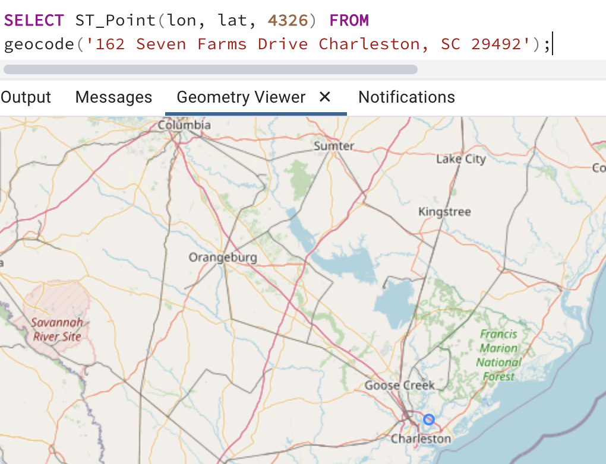

# Using plpython3u to Interact With Web-Based Geocoders

While it's possible to build a [fully featured geocoder in Postgis](https://postgis.net/docs/postgis_installation.html#install_tiger_geocoder_extension),
there may be reasons one may not want to. Speficially, the Tiger geocoder requires downloading large amounts of census data, and in space-limited databases, this may not be feasible. 
What if we could use  a python function using `plpython3u` to hit a web service geocoder every time that we got a new row in the database? In this demo we'll walk through setting this up. 


## Installing plpython3u

`plpython3u` comes with Crunchy Bridge, so no tricky installation required!  
Simply run the following: 
```
CREATE EXTENSION  plpython3u;
```

## Creating a function to geocode addresses 

In this example, I'll use the [census geocoding API](https://geocoding.geo.census.gov/geocoder/Geocoding_Services_API.html) as our web service, and build a function to geocode addresses based on that. 

The function is fairly straightforward, and puts together parameters to hit the census geocoding API and then parse the resulting object. It's important to note that in order to have the function return a latitude/longitude
pair, the function has to return a `Type`

```
CREATE TYPE latlon as (
	lat float,
	lon float
); 
```

```
CREATE OR REPLACE FUNCTION geocode(address text)
RETURNS latlon
AS $$
	import requests
	payload = {'address' : address , 'benchmark' : 2020, 'format' : 'json'}
	base_geocode = 'https://geocoding.geo.census.gov/geocoder/locations/onelineaddress'
	r = requests.get(base_geocode, params = payload)
	coords = r.json()['result']['addressMatches'][0]['coordinates']
	print(r.json())
	lon = coords['x']
	lat = coords['y']
	return(list([lat, lon]))

$$
LANGUAGE 'plpython3u';

```

Using this function to geocode Crunchy Data's headquarters:

```
SELECT ST_Point(lon, lat, 4326) FROM 
geocode('162 Seven Farms Drive Charleston, SC 29492');
```



We can also use a simple SQL wrapper function to make this conveniently return points.

```
CREATE OR REPLACE FUNCTION geocode_address (address text)
RETURNS GEOMETRY AS 
$$
SELECT ST_Point(lon, lat, 4326) as geom FROM
		geocode(address)
$$
LANGUAGE sql;
```


## Deploying this function! 

But what if we want to automically run this every time an address is inserted into a table? Let's say we have a table with a field ID, an address, and a point that we want to auto-populate on inserts?

```
CREATE TABLE addresses (
	fid SERIAL PRIMARY KEY NOT NULL,
	address varchar,
	geom GEOMETRY(POINT, 4326)
);
```

We can make use of a postgres trigger to add the geocode before every insert! 


```
CREATE OR REPLACE FUNCTION add_geocode()
RETURNS trigger AS
$add_geocode$ 
DECLARE pt_geom geometry;
BEGIN 
	RAISE NOTICE 'geocoding %', NEW.address;
	SELECT * FROM
	geocode_address(NEW.address)
	INTO pt_geom;
	NEW.geom = pt_geom;
	RETURN NEW;
END;
$add_geocode$ 
LANGUAGE plpgsql;
```

```
CREATE TRIGGER update_geocode BEFORE INSERT ON addresses
    FOR EACH ROW EXECUTE FUNCTION add_geocode();
	
```

Now when running an insert, the value is automatically geocoded! 

```
INSERT INTO addresses(address) VALUES ('415 Mission St, San Francisco, CA 94105');
```

```
postgres=# select * from addresses;
 fid |                 address                 |                        geom
-----+-----------------------------------------+----------------------------------------------------
   1 | 415 Mission St, San Francisco, CA 94105 | 0101000020E610000097CD0E2B66995EC0BB004B2729E54240
```

## Summary: 

PostgresSQL triggers are a very powerful way to leverage built in functions to automatically transform your data as it enters the database, and this particular case is a great demo for them!


