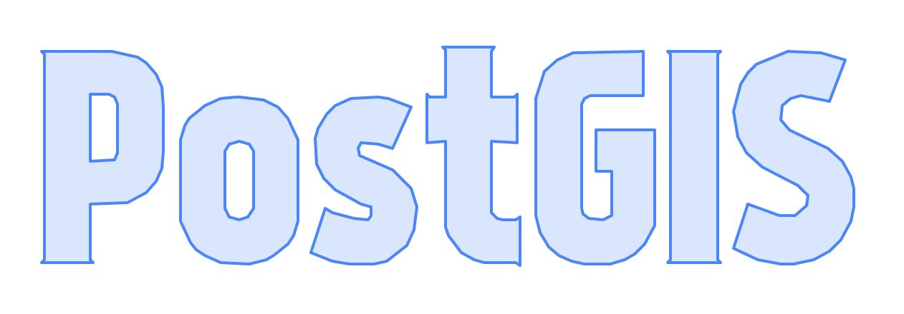
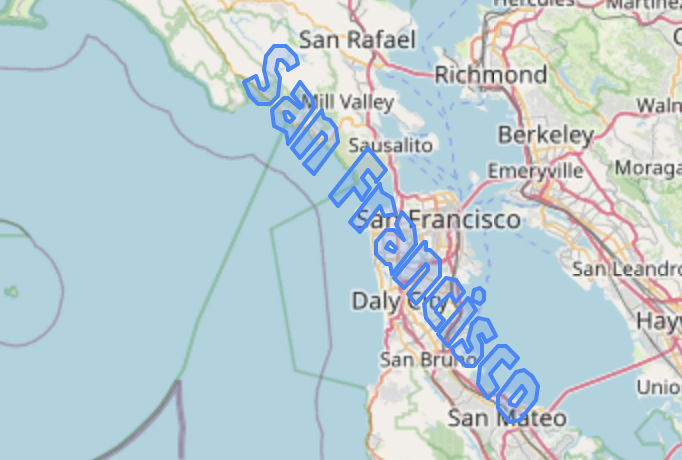

### Fun with words, concave hulls, and alpha shapes in PostGIS 3.3.0!

There are a few new fun functions in PostGIS 3.3.0, which are worth exploring in this post.

## ST Letters

First, my brilliant colleague at Crunchy Data, Paul Ramsey introduced a function to generate polygons that look like letters! This is objectively really, really cool and a fun use case for demos. Here's a simple example.

`Select ST_Letters('PostGIS');`



But it's also possible to overlay letters on a map, just like any other polygon. 

```With pt as (select 
			(st_setsrid(st_makepoint(-122.48, 37.758), 4326)) as geometry),
	letters as (select (st_setsrid(st_scale(
					   st_letters('San Francisco'), 0.001, 0.001),
								 4326)) as geometry),
	letters_geom as (
		select 
			st_translate(
			letters.geometry, 
			st_x(pt.geometry) - st_x(st_centroid(letters.geometry)),
			st_y(pt.geometry) - st_y(st_centroid(letters.geometry))

			) as geometry
		from letters, pt
	)
	select st_srid(geometry)
	from letters_geom;```


