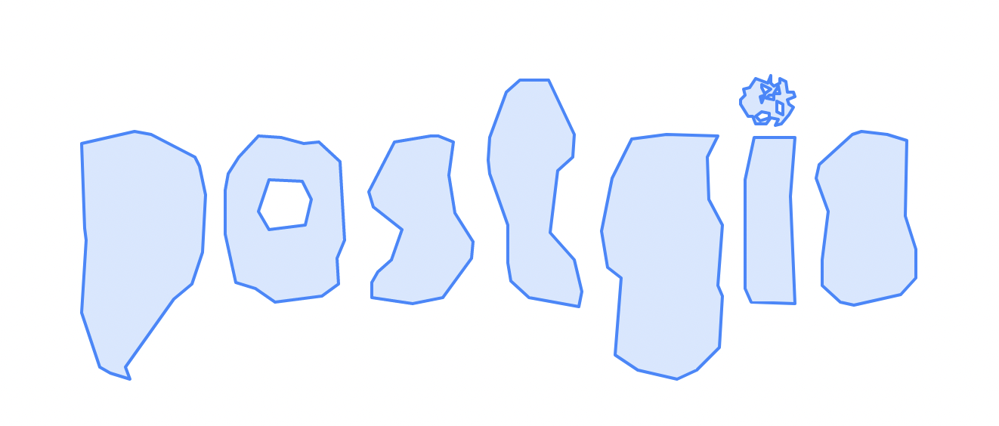
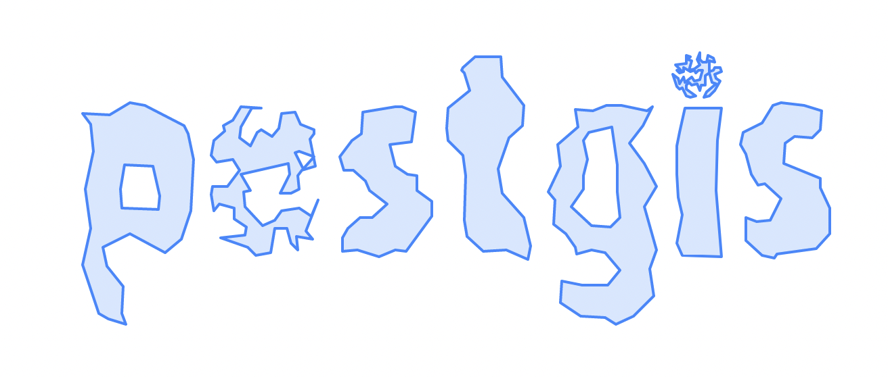

# Fun with Letters in PostGIS 3.3!

There are a few new fun functions in PostGIS 3.3 which are worth exploring in this post.

## ST_Letters

First, my colleague at Crunchy Data, Paul Ramsey introduced a function to generate polygons that look like letters! This is objectively really cool and a fun use case for demos. Here's a simple example.

`Select ST_Letters('PostGIS');`


But it's also possible to overlay letters on a map, just like any other polygon. Since the default for `ST_Letters` results in a polygon starting at the baseline at the origin of the chosen projection, with a maximum height of 100 "units" (from the bottom of the descenders to the tops of the capitals),we need a way to both move it and resize it. For context, this is what the default args look like with the WGS84 projection. 


Not ideal. First, we want to make a point in the middle of San Francisco in order to serve as a centroid for where we want to move the letters, and we also want to rescale the letters in order to approximately fit over the City of San Francisco. Using the formula for convering units in WGS84 to meters, 0.001 works approximately well enough to fit over the San Francisco Bay Area. Next we use `ST_Translate` in order to move the letters from the top of the map to fit over the Bay Area. Finally, mostly because it looks cool, we use `ST_Rotate` to rotate the polygon 45 degrees. 

```
With san_fran_pt AS (Select (ST_SetSRID(ST_Makepoint(-122.48, 37.758), 4326)) AS geom),
letters AS (Select (ST_SetSRID(ST_Scale(
                    ST_Letters('San Francisco'), 0.001, 0.001),
                4326)) AS geom),

letters_geom AS (
    Select ST_Translate(
            letters.geom,
            ST_X(pt.geom) - st_x(ST_Centroid(letters.geom)),
            ST_Y(pt.geom) - st_y(ST_Centroid(letters.geom))

        ) AS geom
    FROM letters, san_fran_pt
)
Select ST_Rotate(geom, -pi() / 4, ST_Centroid(geom))
FROM letters_geom;

```


# Use Cases?

Besides interesting visualizations, `ST_Letters` is great for demoing PostGIS functions. Here's a short demo of how different parameters of `param_pctconvex` and `param_allow_holes` for `ST_ConcaveHull` interpolate points generated by `ST_GeneratePoints` and `ST_Letters`. 

First, let's generate a table of randomly generated points that fill in the letters in 'postgis'
```
CREATE TABLE public.word_pts AS (
With word as (
	Select ST_Letters('postgis') as geom
	),
	letters as ( -- dump letter multipolygons into individual polygons
		Select ((ST_Dump(word.geom)).geom) 
	 		FROM word
	 		)
		Select ST_GeneratePoints(letters.geom, 100) as pts FROM
			letters
	);
```

`Select pts FROM word_pts.pts` 


First, we set the convexity to a fairly high parameter (`param_pctconvex=0.75`, indicating a highly convex shape), and don't allow there to be holes in the shape (`param_allow_holes=true`)


`Select ST_ConcaveHull(pts, 0.5, false), letters.geom FROM word_pts`; 


Doesn't look much like 'postgis'! 

Next, we relax the convexity, but don't allow holes in the shape. 

`Select ST_ConcaveHull(pts, 0.5, true) FROM word_pts`


A little better, but still hard to recognize 'postgis'. What if we allowed holes?

`Select ST_ConcaveHull(pts, 0.5, true) FROM word_pts`

This starts to look a bit more like the word 'postgis', with the hole in 'p' being clear. 



As we start to make the shape more concave, it begins to take on more and more recognizable as 'postgis'....until it doesn't and starts to look closer to modern art. 

`Select ST_ConcaveHull(pts, 0.25, true) FROM word_pts`



`Select ST_ConcaveHull(pts, 0.05, true) FROM word_pts`


## Summary:

ST_Letters is a really useful function for both visualization and demoing how certain geometric functions work in PostGIS, and provides a useful starting point for demoing functions on points and polygons. 